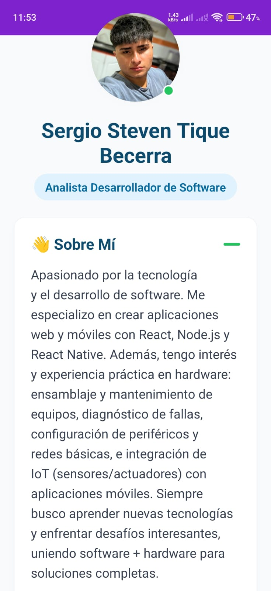
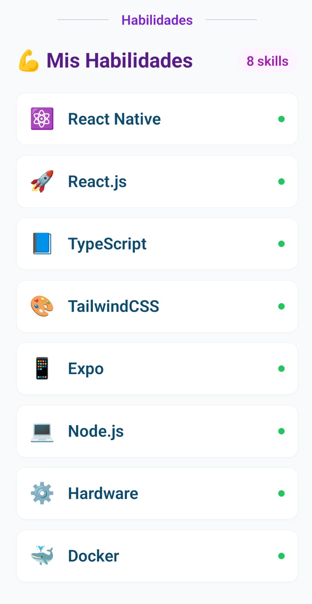
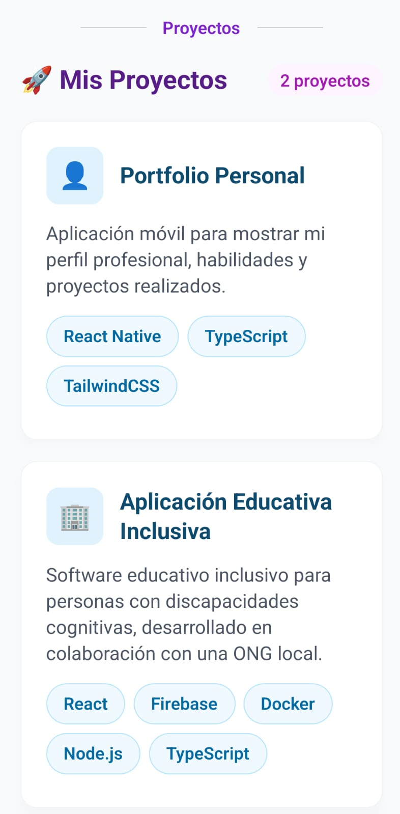
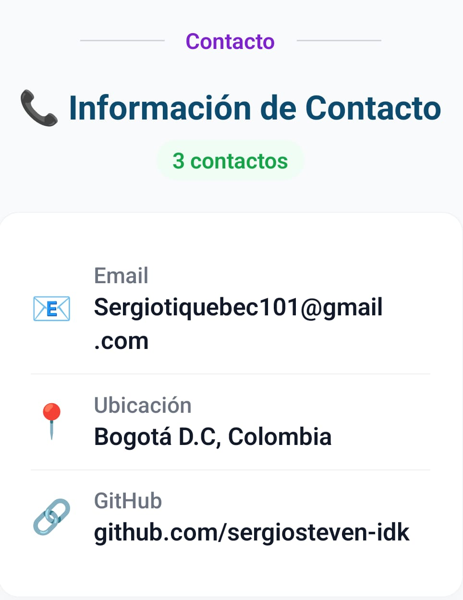

# 🚀 Proyecto Integrador – Semana 1: Mi App Personal

**👨‍💻 Autor:** Sergio Steven Tique Becerra  
**📅 Fecha:** 2025-10-21  
**📄 Descripción breve:** App personal con perfil, habilidades, proyectos y contacto; construida con React Native (Expo) + TypeScript + TailwindCSS (NativeWind).

---

## 📸 Capturas de pantalla

<div align="center">






</div>

---

## ⚙️ Instalación y ejecución

```bash
pnpm install
pnpm start
